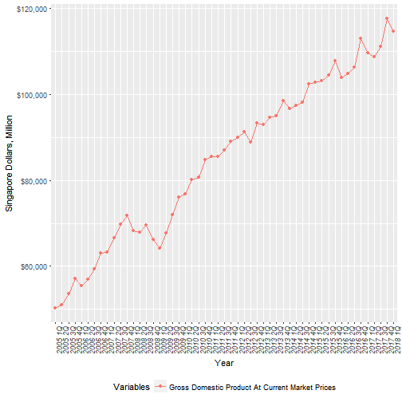

## Singapore GDP Data Presentation 

The App uses the latest Singapore GDP Data from SingStat and let the user select features and date range to plot the data.

SingStat is a Singapore Government website that provides census data.  For more information, visit:

https://www.singstat.gov.sg/find-data/search-by-theme/economy/national-accounts/latest-data

--- .class #id 

## Singapore GDP App Features

1. Allow users to pick from 10 different GDP variables.  Multiple choices are allowed.
Variables include: Gross Domestic Product, Manufacturing, Construction, Wholesale and retail... etc.

2. Allow users to pick a data range from 1998 to present (past 20 years).

---

## How to use the App

The selections are presented on the top page of the app.  

    

On the left is the selection panel for varaibles you want to plot.  You can choose multiple variables.

On the right is the date range.  Select a range of years to plot by moving the sliders.

---
## Plot of Singapore GDP

This is a sample output plot from the App

